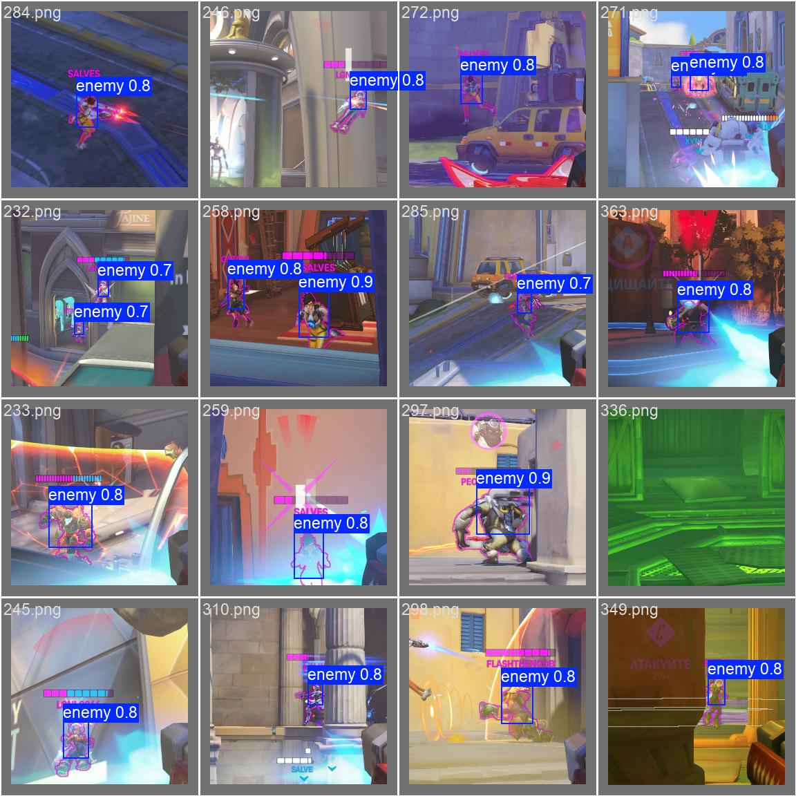

# Overwatch 2 AI Aimbot
---

## Demo

<video src="overwatch-2-ai-aimbot/demo/demo.mp4" controls width="640"></video>
---
## Neural Model

The project uses a YOLOv8s model, trained on a custom Overwatch 2 dataset to detect enemy players.

- Architecture: YOLOv8s (Ultralytics)
- Input image size: 256x256
- Epoches: 65

---
## Training

The model was trained on a custom dataset with:

- Annotation tools: Cvat
- Number of images: 510
- Image size: 256x256
- Framework: Ultralytics YOLOv8 (PyTorch-based)

The gameplay was recorded with a disabled crosshair.
The videos were then manually split into individual frames, and the targets were annotated in CVAT.

---
## Screenshot Capture

Screen capture is performed using the `mss` python library:

- The capture is performed at the center of the screen with a size of 256x256 pixels.
- Frame is converted from BGRA to BGR and processed by the YOLO model in real time.

---
## Aiming Logic

The aimbot first searches for the closest bounding box that contains the target outline color (using an HSV color filter). This helps to avoid false detections.
After finding the best box, its position is converted into an offset from the center of the screen.  
This offset is then multiplied by the aimbot speed and used to move the mouse for aiming.

---
## Important Notes

- Enemy outline must be set to **Magenta**.
- You will need your own **mouse driver** or **Arduino** for mouse control.

---
## TODO

- Increase the size of the training dataset
- Add a GUI for easy configuration
- Implement non-linear aiming curve for smoother aiming (instead of linear offset)
